# 因子生成与动态选股研究流程图

本文档整理因子生成、质量评价、标准化回测、市场状态识别、动态因子选择、组合构建及强化学习反馈闭环等研究流程。图中实线表示当前研究主流程，虚线表示规划中的扩展环节。

## 图1 研究总体框架

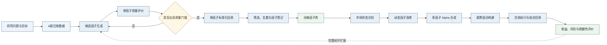

## 图2 数据与研究样本构建

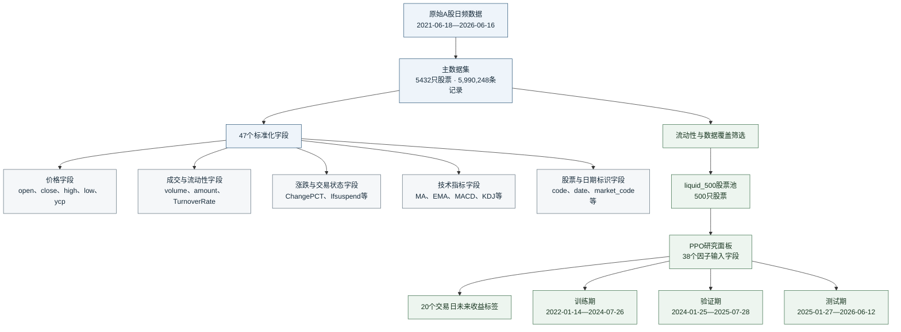

## 图3 PPO候选因子生成机制

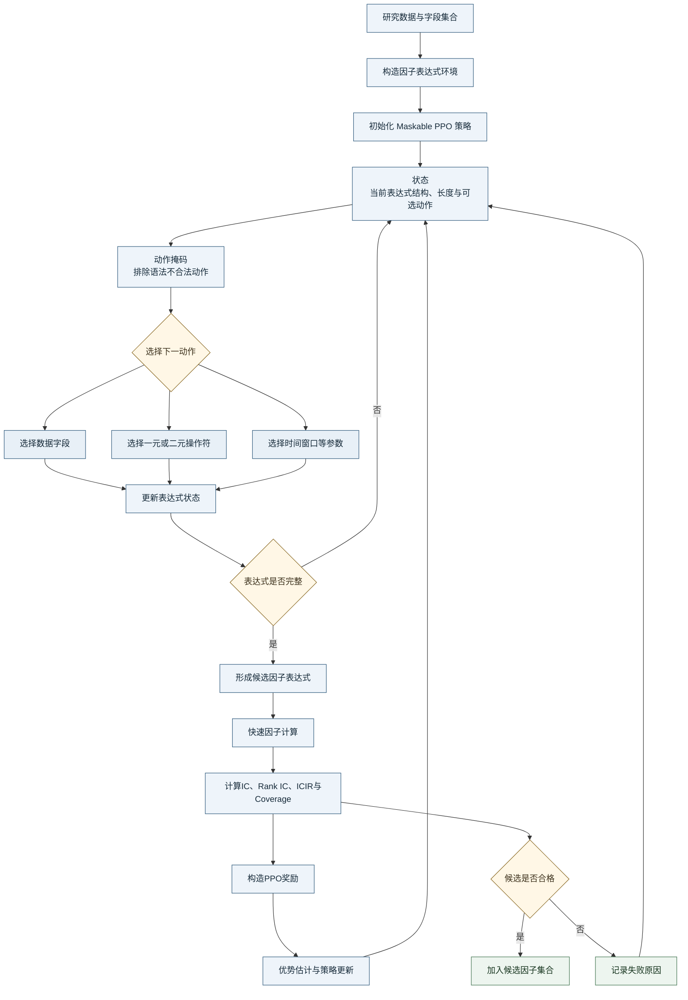

## 图4 单因子质量评价流程

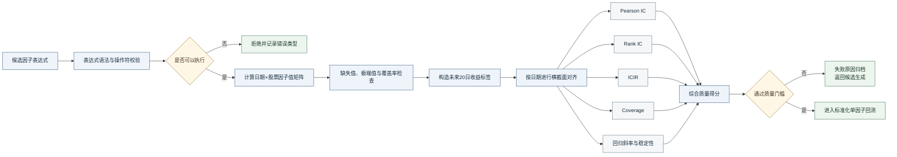

## 图5 标准化单因子回测

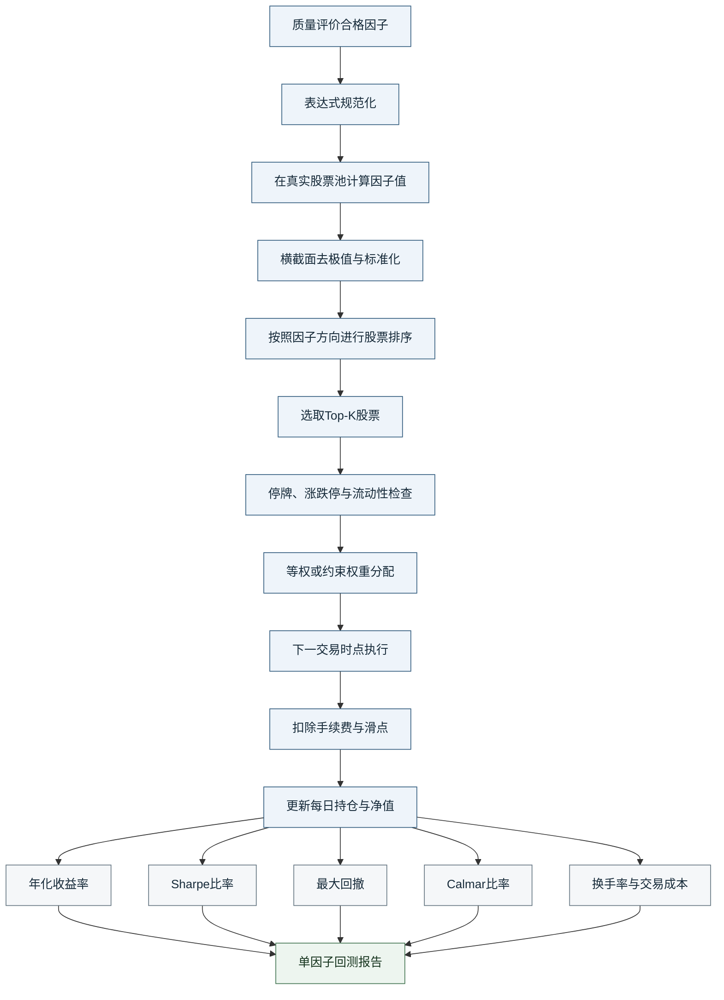

## 图6 因子筛选、去重与入库

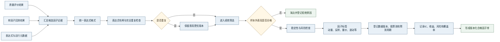

## 图7 市场状态识别与条件因子分析

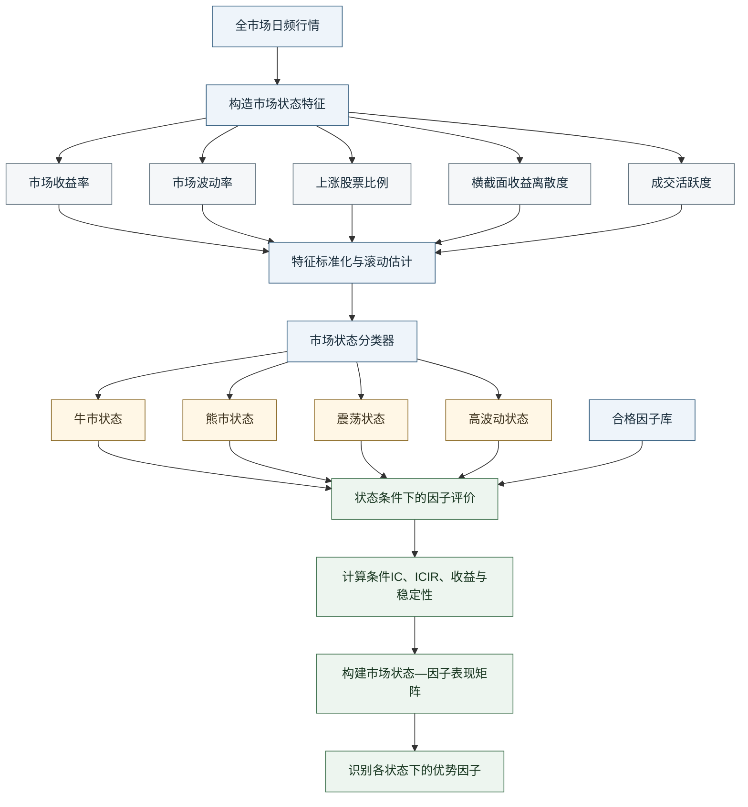

## 图8 动态因子选择与路由

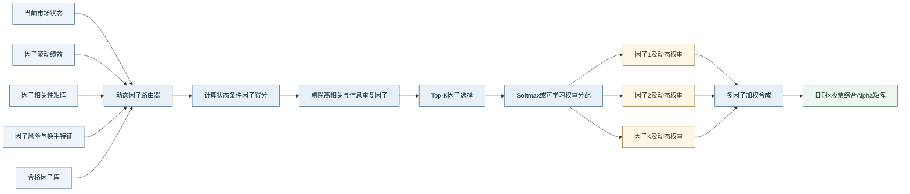

## 图9 Alpha合成与股票组合构建

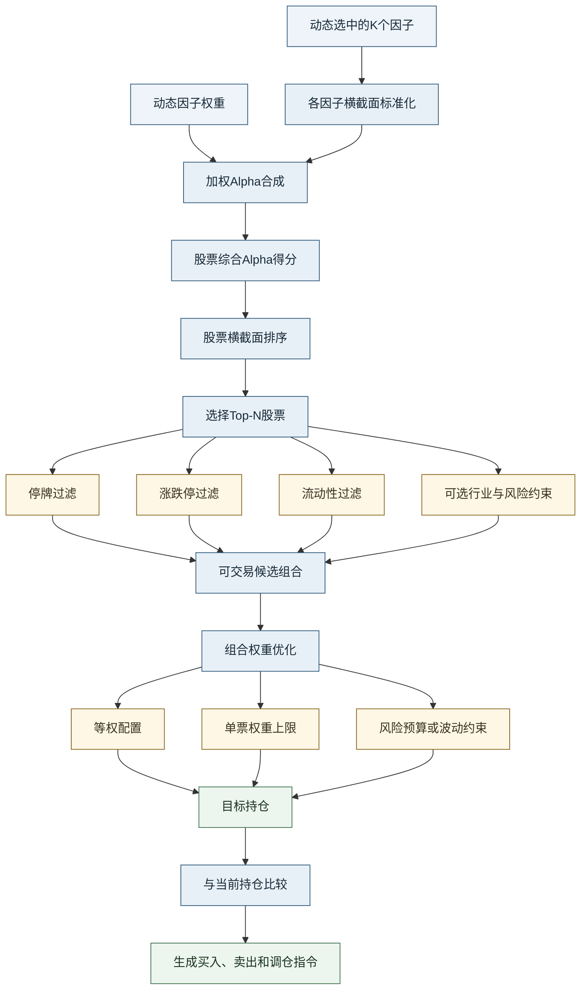

## 图10 交易执行与绩效反馈

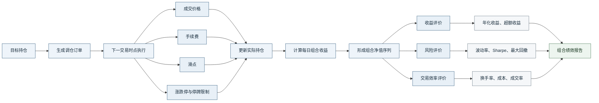

## 图11 强化学习奖励反馈闭环

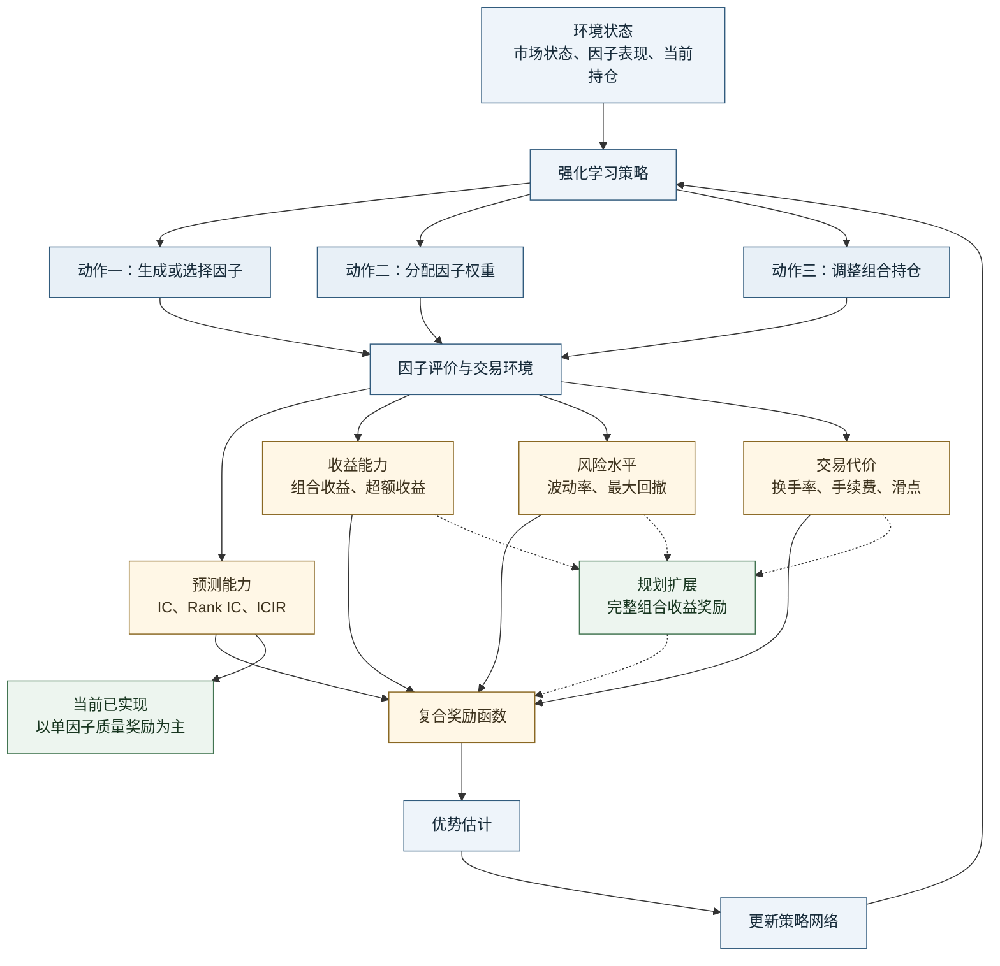

## 图12 实验设计与学术验证框架

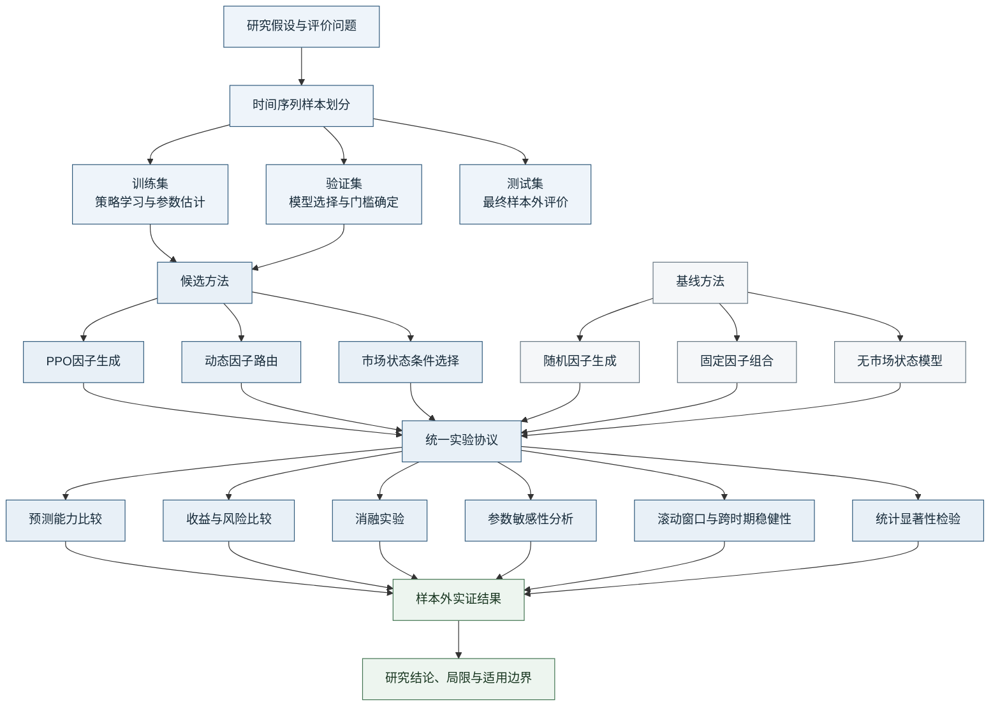
