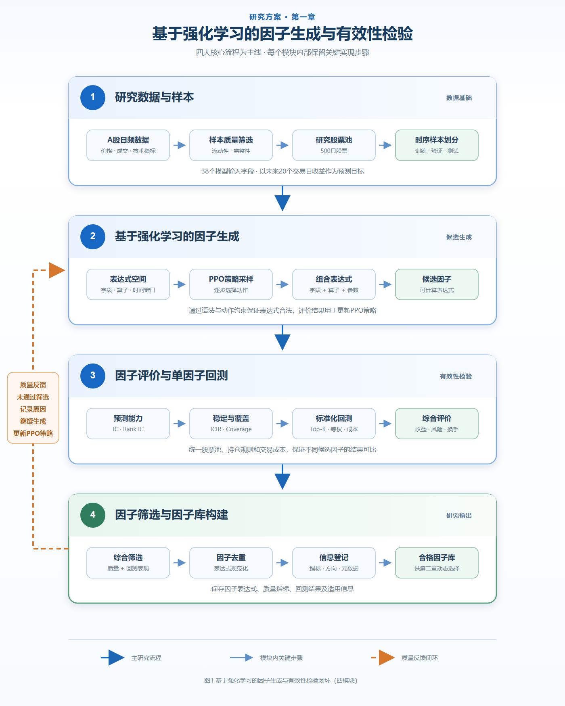

# 第一章 基于强化学习的因子生成与有效性检验

本章围绕候选因子的自动生成、有效性评价和筛选入库展开，主要回答以下问题：如何利用强化学习生成候选因子，以及如何通过统一评价形成可供后续选股研究使用的合格因子库。

本章的总体流程如图1所示。图中以四个核心模块构成研究主线，每个模块内部进一步列出关键子流程，从而同时呈现研究框架与实现要点。左侧反馈线表示未通过筛选的候选因子被记录后，评价结果返回因子生成阶段，用于继续搜索并更新PPO策略。



*图1 基于强化学习的因子生成与有效性检验闭环（四模块）*

## 1.1 研究数据与样本

本研究以A股市场日频股票数据作为基础研究对象。原始数据覆盖2021年6月18日至2026年6月16日，共包含5432只股票、约599万条日频记录和47个标准化字段。数据内容主要包括开盘价、收盘价、最高价和最低价等价格信息，成交量、成交额和换手率等交易信息，以及移动平均线、MACD和KDJ等常用技术指标。这些数据为候选因子的生成、评价和回测提供了统一的数据基础。

考虑到部分股票存在上市时间较短、交易不连续或流动性不足等问题，本研究根据股票的成交活跃度和数据完整性进行样本筛选，最终构建由500只股票组成的研究股票池。采用相对稳定且具有较好流动性的股票样本，可以减少停牌、成交不足和数据缺失对因子评价结果的干扰，同时保证因子具有基本的实际交易可行性。

在因子生成阶段，研究从主数据中选取38个与价格、成交、涨跌状态和技术指标相关的字段作为模型输入。强化学习模型通过组合这些字段及相应的数据处理操作，自动构造候选因子表达式。为评价因子对股票未来收益的预测能力，本研究以未来20个交易日的股票收益率作为预测目标，将当期因子值与后续收益进行匹配。

为降低使用未来信息造成的数据泄漏风险，研究样本按照时间顺序划分为训练阶段、验证阶段和测试阶段。训练数据用于强化学习策略更新和候选因子生成，验证数据用于评价因子的稳定性并进行筛选，测试数据用于检验因子的样本外表现。整个研究过程中保持股票池、字段范围、预测周期和评价规则的一致性，从而提高不同因子实验结果之间的可比性。

本节的数据准备过程可以概括为：

```text
A股日频数据
→ 流动性与完整性筛选
→ 500只股票研究样本
→ 38个因子输入字段
→ 未来20日收益预测目标
```

## 1.2 基于强化学习的因子生成

传统因子研究通常依赖研究人员根据金融逻辑和市场经验设计因子。人工设计方法具有较强的可解释性，但能够探索的表达式数量有限。为了扩大因子搜索范围，本研究将因子生成建模为序列决策问题，并利用近端策略优化算法（Proximal Policy Optimization，PPO）自动生成候选因子。

在这一过程中，数据字段、数学操作符和时间窗口共同构成因子表达式的基本元素。模型根据当前表达式状态逐步选择字段、操作符和相关参数，直至形成完整的候选因子。例如，模型可以对价格或成交量数据执行排序、延迟、移动平均和标准化等操作，以构造不同类型的量价因子。

为保证生成结果能够被正确计算，系统在因子生成过程中设置动作约束，排除不符合表达式语法或操作符使用规则的动作。因此，强化学习策略并不是在完全无约束的空间中随机组合公式，而是在预先定义的合法表达式空间中进行搜索。

每生成一个完整的候选因子，系统就计算该因子在研究样本中的取值，并使用信息系数（Information Coefficient，IC）、秩信息系数（Rank IC）、信息比率（ICIR）和数据覆盖率等指标进行快速评价。评价结果被转换为强化学习奖励，用于更新PPO策略。预测能力较好且表现较稳定的因子能够获得更高奖励，从而增加模型后续生成类似有效结构的概率。

候选因子生成过程可以概括为：

```text
研究数据与表达式空间
→ PPO逐步组合字段和操作符
→ 形成候选因子表达式
→ 计算因子预测能力
→ 形成奖励并更新生成策略
```

通过上述方法，系统能够在统一的字段和操作符范围内持续产生候选因子，为后续因子评价和单因子回测提供研究对象。

## 1.3 因子评价与单因子回测

候选因子的生成并不意味着因子具有稳定的预测能力。为了从候选表达式中识别具有研究价值的因子，本研究从统计预测能力和投资应用效果两个层面进行评价。首先利用因子质量指标检验因子与未来收益之间的关系，随后采用统一的单因子回测考察其收益、风险和稳定性。

在统计评价阶段，系统计算因子在每个交易日、每只股票上的取值，并与未来20个交易日的股票收益进行匹配。IC用于衡量因子值与未来收益之间的线性相关关系，Rank IC用于衡量因子排序与未来收益排序之间的相关关系，ICIR用于评价因子预测能力在时间维度上的稳定性，数据覆盖率则用于判断因子是否能够在足够多的样本上形成有效取值。

统计指标能够反映因子的预测关系，但不能完全说明因子的实际投资效果。因此，通过质量评价的因子还需要进入标准化单因子回测。回测过程中，系统根据因子值对股票进行横截面排序，选择排名靠前的股票构建组合，并采用统一的持仓、调仓和交易成本规则计算组合净值。

为了保证不同因子的回测结果具有可比性，所有候选因子使用一致的股票池、回测时间、选股数量、权重分配和交易成本设置。回测结果主要包括组合收益率、Sharpe比率、最大回撤、换手率和交易成本等指标。这些指标分别反映因子的收益能力、风险水平和交易可实现性。

因子评价与单因子回测可以概括为：

```text
候选因子
→ 统计预测能力评价
→ 质量门槛筛选
→ 标准化单因子回测
→ 收益、风险与交易效率评价
→ 形成综合评价结果
```

这种两阶段评价方式同时关注因子与未来收益之间的统计关系和因子的实际投资表现，为后续因子筛选提供统一依据。

## 1.4 因子筛选与因子库构建

经过质量评价和单因子回测后，每个候选因子都形成了包括预测能力、稳定性、收益表现和风险水平在内的评价结果。本研究在此基础上进行综合筛选，将统计关系不稳定、样本覆盖不足或回测表现较弱的因子予以剔除，保留具有相对稳定表现的因子。

因子筛选并不单纯追求某一项指标的最大值，而是综合考虑多个评价维度。一个可保留的因子应具有基本的收益预测能力，在不同研究阶段保持相对一致的表现，并具备足够的数据覆盖范围。同时，因子的回测收益需要与其风险和交易成本相匹配，避免仅因局部时期的较高收益而保留波动过大或换手率过高的因子。

为减少候选因子中的重复信息，系统进一步对因子表达式进行规范化处理，并检查表达式是否重复。对于计算逻辑相同或表达式结构完全重复的因子，仅保留综合表现较好的版本。该过程能够避免因子库中出现大量重复因子，提高因子集合的有效性。

对于最终保留的因子，系统记录其表达式、使用字段、预测方向、数据范围、质量指标和回测结果等信息。这些信息用于描述因子的基本特征，也为后续分析因子在不同市场环境下的表现提供依据。经过统一登记后，合格因子被保存至因子库，并作为动态因子选择和多因子选股阶段的输入。

因子筛选与入库过程可以概括为：

```text
因子质量评价结果
＋
单因子回测结果
→ 综合筛选
→ 重复因子处理
→ 因子信息登记
→ 合格因子库
```

## 1.5 本章小结

本章介绍了从研究数据到合格因子库的完整研究过程。首先，基于A股日频数据构建统一的研究股票池和模型输入；其次，利用PPO在合法的表达式空间中自动生成候选因子；随后，从统计预测能力和单因子回测表现两个层面对候选因子进行评价；最后，通过综合筛选、重复处理和信息登记形成合格因子库。

第一章解决了“如何生成因子以及如何判断因子是否具有研究价值”的问题。形成的合格因子库为下一章的市场状态分析、动态因子选择和股票组合构建提供基础。
