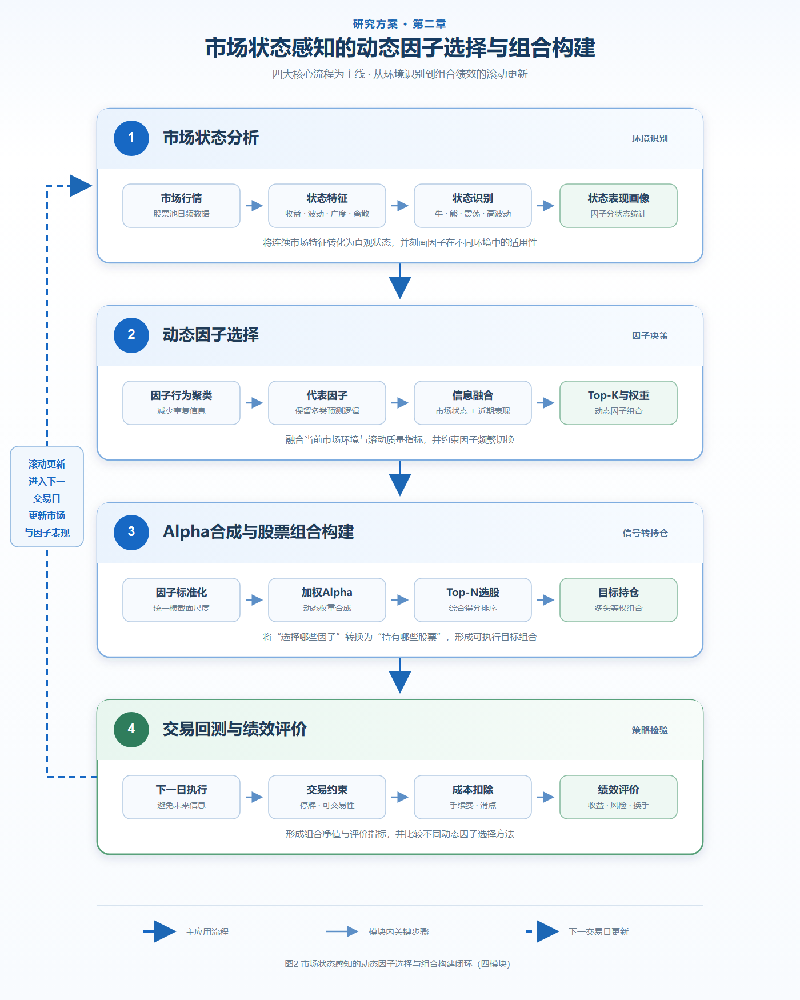

# 第二章 市场状态感知的动态因子选择与组合构建

本章研究如何将第一章形成的合格因子库应用于股票选择，主要回答以下问题：如何根据市场环境和因子近期表现动态选择因子，并利用所选因子构建股票组合。

本章的总体流程如图2所示。图中以四个核心模块描述从市场状态分析到组合绩效评价的应用过程，每个模块内部列出必要的关键子流程。左侧虚线表示系统进入下一交易日后重新计算市场状态和因子近期表现，由此形成动态更新闭环。



*图2 市场状态感知的动态因子选择与组合构建闭环（四模块）*

## 2.1 市场状态分析

金融市场的收益和风险特征会随时间发生变化，同一个因子在不同市场环境下可能表现出不同的有效性。因此，在进行动态因子选择之前，需要对当前市场环境进行识别，并分析不同因子在各类市场状态下的表现。

本研究以股票池内全部股票的日频行情为基础，构造市场收益率、市场波动率、上涨股票比例和横截面收益离散度等市场特征。市场收益率反映股票池的整体涨跌方向，市场波动率反映市场风险水平，上涨股票比例反映市场涨跌的广泛程度，横截面离散度则描述不同股票收益表现之间的差异。

在得到市场特征后，系统根据市场收益方向和波动水平，将不同交易日划分为牛市、熊市、震荡和高波动四类状态。其中，牛市和熊市主要反映市场的趋势方向，震荡状态表示市场整体方向不明显，高波动状态表示市场风险处于相对较高水平。通过这一分类，可以将连续的市场特征转换为直观的市场状态标签。

系统按照交易日期保存市场状态，并将其与因子值和未来收益数据进行对齐。在此基础上，分别计算各因子在不同市场状态下的预测表现，分析因子的IC、Rank IC和稳定性是否随市场环境发生变化。由此可以识别某些因子更适合的市场状态，为后续动态因子选择提供依据。

市场状态分析过程可以概括为：

```text
全市场日频行情
→ 构造市场收益与风险特征
→ 识别牛市、熊市、震荡和高波动状态
→ 分析不同状态下的因子表现
→ 形成市场状态与因子表现信息
```

本节的输出包括每日市场状态以及不同因子在各类市场状态下的表现。这些结果将与因子的近期滚动表现共同作为动态因子选择的输入。

## 2.2 动态因子选择

合格因子库中的因子可能具有不同的预测逻辑和市场适用范围。如果直接将所有因子进行固定组合，不仅容易引入重复信息，也无法反映因子有效性随市场环境发生的变化。因此，本研究在市场状态分析的基础上，构建动态因子选择方法，根据市场特征和因子近期表现调整参与组合的因子及其权重。

首先，系统根据因子的历史表现特征对因子进行聚类。对于表现方式相近的因子，将其划分到同一类别，并从每个类别中选择具有代表性的因子。该过程可以减少因子之间的信息重复，控制后续动态选择的因子数量，同时保留不同类型因子的主要预测信息。

随后，系统从两个方面评价代表因子。第一类信息来自当前市场环境，包括市场收益、市场波动、上涨股票比例和横截面离散度；第二类信息来自因子的近期表现，包括滚动IC、Rank IC、稳定性和覆盖情况等。市场信息反映因子当前所处的外部环境，近期表现则反映因子自身预测能力的变化。

动态因子路由模型分别对市场信息和因子表现信息进行处理，并将两类结果融合为每个因子的动态得分。得分越高，表示该因子在当前市场环境下具有更高的相对适用性。与固定因子组合相比，这种方法允许因子的选择结果和组合权重随时间变化。

在得到动态得分后，系统采用Top-K方法选出当前得分较高的若干因子，并将因子得分转换为组合权重。为减少因子频繁切换带来的不稳定性，模型训练过程中同时考虑因子权重的变化程度，使相邻时期的因子选择保持一定连续性。

动态因子选择过程可以概括为：

```text
合格因子库
→ 因子行为聚类
→ 选择代表因子
→ 融合市场状态与因子近期表现
→ 计算动态因子得分
→ 选择Top-K因子并分配权重
```

本节最终形成随交易日期变化的“因子—权重”结果。该结果既说明当前使用哪些因子，也说明不同因子在综合Alpha中的相对作用，为下一节的Alpha合成和股票组合构建提供直接输入。

## 2.3 Alpha合成与股票组合构建

动态因子选择阶段得到的是不同交易日期下的因子集合及其对应权重。为了将因子层面的选择结果转换为具体的股票投资信号，本研究进一步对多个因子进行加权合成，计算每只股票的综合Alpha得分，并根据该得分构建股票组合。

由于不同因子的数值范围和分布特征存在差异，系统首先对每个交易日的因子值进行横截面标准化。该处理使不同因子具有相对一致的数值尺度，避免某个因子仅因取值范围较大而对综合结果产生过度影响。

完成标准化后，系统按照动态因子选择阶段得到的权重，对各因子进行加权求和。对于部分因子值缺失的股票，系统仅利用当前可用的因子进行计算，并根据有效权重进行调整。最终，每个交易日的每只股票都会得到一个综合Alpha得分。

综合Alpha得分反映模型对股票未来相对收益的判断。系统按照Alpha得分从高到低对股票进行横截面排序，并选择排名靠前的Top-N只股票作为候选持仓。因子选择决定“当前使用哪些因子”，而股票选择决定“当前持有哪些股票”，两者属于不同的决策层次。

在组合权重方面，本研究采用多头等权方式进行配置，即将组合资金平均分配给被选中的股票。等权方式结构简单，可以减少复杂权重优化对实验结果的干扰，使研究能够更直接地观察动态因子选择和Alpha合成对选股结果的影响。

对于无法正常交易的股票，系统根据交易状态调整实际持仓。例如，当已有持仓股票处于停牌状态时，系统保留该部分持仓，并将剩余资金重新分配给其他可交易的候选股票。经过处理后，系统形成下一交易日需要执行的目标持仓。

Alpha合成与组合构建过程可以概括为：

```text
动态因子及其权重
→ 因子值横截面标准化
→ 多因子加权合成
→ 计算股票综合Alpha得分
→ 股票横截面排序
→ 选择Top-N股票
→ 构建多头等权组合
```

本节最终将动态因子选择结果转换为股票层面的目标持仓，使因子研究与实际组合回测连接起来。

## 2.4 交易回测与绩效评价

为了检验动态因子选择和股票组合构建方法的实际效果，本研究使用历史行情数据对目标持仓进行回测。回测过程按照时间顺序逐日推进，将每个交易日产生的Alpha信号用于下一交易日的组合调整，以避免使用当日尚未完全获得的信息进行交易。

在每次调仓时，系统将目标持仓与上一期实际持仓进行比较，计算股票权重的变化，并据此得到组合换手率。对于正常交易的股票，系统按照新的目标权重调整持仓；对于停牌等无法交易的已有持仓，则暂时保留其原有权重，并将剩余可用资金分配给其他可交易股票。

回测过程中同时考虑手续费和滑点。系统首先根据股票价格变化计算组合的交易前收益，再根据持仓调整幅度计算交易成本，最终得到扣除成本后的组合净收益：

```text
组合净收益
＝
组合交易前收益
－
换手率 ×（手续费率＋滑点率）
```

在得到每日组合净收益后，系统进一步构建组合净值序列，并从收益、风险和交易效率三个方面评价策略表现。收益指标主要包括累计收益率和年化收益率；风险调整指标包括Sharpe比率和Calmar比率；风险指标主要使用最大回撤；交易效率指标则包括平均换手率、交易成本、交易次数和平均持股数量。

为了分析不同模块对选股结果的作用，本研究设置四组递进式对照实验：

1. 代表因子等权组合，仅使用因子聚类结果，不进行动态权重调整。
2. 基于市场特征调整因子权重，用于检验市场状态信息的作用。
3. 融合市场特征与因子近期表现，用于检验因子表现信息的增量作用。
4. 在融合模型中加入Top-K因子选择和权重变化约束，形成完整的动态因子选择方法。

四组实验使用相同的数据范围、代表因子、股票选择规则和交易成本设置。通过逐步增加市场信息、因子表现信息和动态选择机制，可以比较不同方法的收益、风险和换手率变化，从而分析各模块对最终组合表现的影响。

交易回测与绩效评价过程可以概括为：

```text
目标持仓
→ 下一交易日执行
→ 计算持仓变化与换手率
→ 扣除手续费和滑点
→ 形成组合净值
→ 计算收益、风险和交易效率指标
→ 比较不同动态因子选择方法
```

本节将因子选择结果转化为可量化的组合绩效，并通过统一回测和递进式对照实验评价研究方法的有效性。

## 2.5 本章小结

本章围绕市场状态感知的动态因子选择与股票组合构建展开研究，将第一章形成的合格因子库进一步应用于选股和组合回测。

首先，本研究根据股票市场的整体收益、波动水平、上涨股票比例和横截面离散度构造市场特征，并将交易日划分为牛市、熊市、震荡和高波动等市场状态。通过分析因子在不同市场状态下的表现，可以刻画因子有效性随市场环境发生的变化。

其次，系统根据因子的历史行为进行聚类，并从不同类别中选择代表因子。在此基础上，动态因子路由模型融合当前市场特征和因子近期表现，计算每个代表因子的动态得分，选择当前相对适用的Top-K因子并确定相应权重。

随后，系统对所选因子的横截面取值进行标准化，并按照动态权重合成为股票综合Alpha得分。根据Alpha得分对股票进行排序，选取排名靠前的股票构建多头等权组合，从而将因子层面的动态选择转换为股票层面的投资决策。

最后，本研究采用下一交易日执行方式进行历史回测，并在回测中考虑停牌、持仓变化、手续费和滑点等因素。通过累计收益率、年化收益率、Sharpe比率、最大回撤、Calmar比率、换手率和交易成本等指标，评价不同因子选择方法的组合表现。

第二章的研究过程可以概括为：

```text
市场状态识别
→ 因子行为分析与聚类
→ 动态选择因子并分配权重
→ 多因子Alpha合成
→ 股票排序与组合构建
→ 交易回测与绩效评价
```

通过上述研究，第二章完成了从合格因子库到股票组合回测的应用链路。第一章解决“如何生成和筛选有效因子”的问题，第二章解决“如何根据市场环境使用这些因子进行动态选股”的问题。两章共同构成因子生成、因子评价、动态选择和组合验证的整体研究方案。
