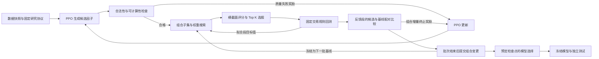

# 研究系统设计 v0.4：固定 Top K 策略下的因子生成与组合反馈

日期：2026-09-20。状态：方法与系统设计稿，尚未实现或验证。本轮范围以研究系统为先，企业日常使用界面延后；v0.3 留作未来产品设计参考。

2026-09-21 数据补充：已确认原始文件 `F:\my_code_file\因子构建\数据\daily_with_maindata_v2.csv` 有 441 列。抽样发现部分财务披露日期晚于对应交易日期；财务数据时点核验与修复属于正式研究前置条件。详见 [原始数据核对记录](2026-09-21-raw-data-inventory.md)。

本稿为当前研究设计入口。沿用 v0.1 的数据时点、交易核算与测试隔离原则；具体闭环、奖励、因子池更新和研究工作区以本文为准。遗传算法不是系统要求。

## 1. 要研究的唯一主问题

在相同数据、固定 Top K 交易规则与可比较的计算预算下，让组合交易表现反过来训练公式因子生成器，是否能改善最终样本外选股表现？

优化对象是「评分函数的构成」：哪些因子参与、各因子的评分权重、下一轮生成什么因子。股票由分数排名选出。首版不同时优化交易时点、Top K 数量、调仓周期、股票池资格或私有买卖规则，否则难以判断提升来自哪里。

算法分工：PPO 学习表达式生成分布；组合优化器搜索因子子集与权重；回测器按固定规则执行并评价。PPO 不是买卖股票的智能体，组合优化器也不是必然采用遗传算法。

研究依据：AlphaGen 用组合模型的表现训练公式生成器；其原文算法使用新组合的 IC 作为终止奖励，并以预测损失拟合组合。本系统提出「固定交易协议下的配对增量表现奖励」，需要独立实验检验，不能说原论文已经证明本方案有效。[AlphaGen 原文](https://arxiv.org/html/2306.12964v1)

## 2. 系统主线与反馈关系



图中的回测调用有两种数据权限：内层搜索只访问拟合段 F；给生成器计算奖励只在权重冻结后访问反馈段 E。它们共用执行代码，不能共用不受限的数据入口。

两条核心学习闭环与一条辅助闭环：

| 闭环 | 反馈内容 | 实际改变什么 | 执行频率 |
|---|---|---|---|
| 组合优化闭环 | 拟合段扣费后的收益风险目标 | 下一次子集/权重提案、搜索步长或接受决策 | 每个内层提案 |
| 因子生成闭环 | 新因子对组合的训练内增量表现 | PPO 的策略和价值网络参数 | 每个 rollout 批次 |
| 质量反馈闭环 | 非法表达式、退化、覆盖不足等预定义失败 | 无效候选的终止奖励；固定语法规则约束动作 | 每个完成表达式 |

因子池提交是连接批次的状态更新，不额外包装成第三种强化学习算法。最终测试也不是反馈闭环，它是独立检验。

## 3. 先锁定研究协议

每个实验锁定数据快照、字段白名单、股票池规则、时间区间、表达式空间、Top K 执行、成本、目标函数、优化预算、随机种子、提交与停止规则。修改协议派生新实验，不能直接改正在运行的实验。

建议起始协议：日频；t 日收盘评分；下一交易日开盘尝试调仓；Top 50；目标等权；仅做多。K=50 是便于固定对照的起点，不是研究得出的最优值。日线成交采用明确的近似，不能提前利用次日收盘信息决定当天排名。

实际净值由现金、成交、费用与持仓核算。买不进留现金、卖不出保留仓位；不足 K 个候选时不把剩余股票重新放大到满仓。具体交易单位、可卖数量、公司行动与成本须由执行协议定义并验证后用于正式研究。

字段先核验可用时点和缺失情况，不把约 400 项未经核验的属性一次性加入生成空间。先用可追溯字段形成基准实验，再按价量、财务等字段组扩展并做对照。数据来自文件、数据库或接口均归一为同一种快照；研究过程不直接读取持续变化的在线表。

## 4. 评分、目标函数与质量处理

### 4.1 评分与股票选择

\[
a_{k,i,t}=[f_k(X_{\leq t})]_i,\quad
z_{k,i,t}=\frac{a_{k,i,t}-\mu_{k,t}}{\max(\sigma_{k,t},\epsilon)},\quad
s_{i,t}=\sum_k w_kz_{k,i,t}.
\]

均值和标准差在协议指定的当日股票范围内按有限值计算，标准差用总体口径。常数截面置零；缺失单独标记。按 s 排序得到 Top K，分数相同按代码稳定排序。权重满足 L1 范数为 1、有效因子数不超过 m；允许负评分权重，不等于股票做空。

候选质量检查包括语法、允许字段/窗口、有限值覆盖、截面退化与规范化后重复。低单因子 IC 和高因子间相关性保留为诊断指标，首版不作为硬淘汰条件。语法动作掩码是固定合法性约束，不声称掩码本身在学习。

### 4.2 防止因子用缺失值偷偷改变股票池

本稿对 v0.1「任何活跃因子缺失即剔除该股票」作一项研究口径调整：候选因子不能自行改变配对比较的股票资格集合。资格由固定数据规则预先决定；通过覆盖检查后，零星缺失的标准化因子贡献按零处理，并保留标记。研究与冻结模型应用使用同一规则。

这是可检验的中性填充假设，不是缺失值真实等于零。协议同时规定逐日覆盖下限、允许低覆盖日期比例和最大退化比例；不达标的因子直接质量失败。所有活跃因子均缺失的股票不能靠零分被选中：组合提案若在预定资格样本中出现这种情况，视为无效提案，不用临时删股票来获得可比较成绩。初始化选用已通过完整覆盖检查的基准因子，保证起始组合可行。

该限制会缩小可用因子空间；后续可对其他缺失策略做单独消融，但不得在本轮候选与基线两侧采用不同处理。因子覆盖检查只使用 F、E 的数据，不读取选择段或测试段。

### 4.3 组合表现的统一目标

由执行引擎得到扣费净收益 r_t，记 \(\ell_t=\log(1+r_t)\)。首版主目标为：

\[
J_D(B,w)=A\operatorname{mean}_{t\in D}(\ell_t)
-\frac{\lambda}{2}A\operatorname{Var}_{t\in D}(\ell_t).
\]

A 为固定的年化交易日数，λ 为预先登记的风险偏好，D 是明确的数据区间。该目标使收益与波动有明确取舍；它不是已证实最优的金融效用模型。成本已进入净收益，不再重复扣费。净值非正或数值无效按运行失败处理。

同时独立报告年化收益、波动、最大回撤、换手、成本和持仓覆盖。主实验先不把 IC、收益、夏普、回撤等全部加权成一个难以解释的奖励；风险偏好敏感性在固定配置的补充实验中分析。

## 5. 内层：组合优化闭环

给定本批冻结的因子池 B，以及候选 f，分别搜索 B 与 B∪{f}。每个搜索只看 F：

\[
\widehat w_F(S)=\operatorname{Search}_{Q,m}\ J_F(S,w),
\quad \|w\|_1=1,\quad \|w\|_0\le m.
\]

Q 是目标函数调用预算，m 是最大活跃因子数。子集用零权重表示；全零非法。达到 m 后允许替换旧因子，不要求因子池无限增长。搜索输出为有限预算内找到的解，不写成已求得全局最优。

三种可比较的实现：

- 推荐首版：多起点、带零权重/替换动作的坐标与随机扰动搜索。流程可解释，能直接调用不可微的交易目标，便于验证每一步。
- 代理目标拟合：使用组合 IC 或预测损失快速拟合，作为基线或后续加速方案；实际奖励仍需交易评价，不能称完全以交易目标拟合。
- 遗传算法或其他无梯度优化器：后续按相同目标与预算替换，实验验证后再确定是否优于简单搜索。

推荐搜索器固定初始点、扰动尺度列表和随机种子规则。一次提案包含调一个权重、置零/启用一个因子，或池满时替换一个因子；规范化后回测。目标改善则接受，无改善则按预先规定的计数缩小扰动尺度或启动下一个起点，直到 Q 用完。所有约束处理在回测前完成。

每次必须保存「提案 → 目标值 → 接受/拒绝 → 下一搜索状态」。只尝试不同权重却不让评价影响后续搜索/选择，不满足这个闭环。

候选一侧包含旧组合加候选零权重的可行起点；这次评价计入 Q。尽量使用配对随机种子，但不同维度下并不意味着搜索难度相同。同预算只控制机会数量，不证明因果归因或最优公平性。

## 6. 外层：PPO 因子生成闭环

### 6.1 一次强化学习 episode 是一个表达式

状态包含当前表达式前缀/栈，以及本批冻结的因子池上下文；动作是允许字段、算子、常数、时间窗口或结束符。具体观察可用定长补齐的前缀 token、规范顺序的池表达式 token、冻结权重与有效位置掩码。m 和表达式长度有上限，因此观察维度可固定。

构造期间奖励为零，结束时获得一次终止奖励，折扣系数建议 γ=1，公式长度由显式复杂度规则处理。动作掩码参与旧/新策略概率计算。PPO 根据所采样序列、旧概率、价值估计和优势更新策略；无需通过 Top K 或回测器反向求导。[PPO 原论文](https://arxiv.org/abs/1707.06347)

首版允许复用现有表达式编码器，但不能直接假定现有仅前缀观察已包含因子池上下文。即使补充上下文、冻结批次，跨批次奖励环境仍变化，不宣称获得平稳环境或收敛保证。

### 6.2 新因子的奖励来自组合增量

内层在 F 拟合后冻结权重，只在后续 E 评价：

\[
R(S)=J_E(S,\widehat w_F(S)),\qquad
\Delta(f\mid B)=R(B\cup\{f\})-R(B)-\beta\,[C_{new}-C_{base}].
\]

C 是活跃表达式 token 总数除以 \(mL_{max}\)，用统一上限归一化。移除旧表达式可能降低复杂度。β=0 是无复杂度惩罚的必要对照；β 本身不是自动训练出的市场规律。

训练奖励可采用固定尺度的有界变换：

\[
r(f\mid B)=\tanh(\Delta(f\mid B)/\tau),\quad \tau>0.
\]

τ 在实验开始前固定，保存原始 Δ 和变换后的 r；不在每个候选到来时调整尺度。合法且有增量的候选获得正反馈，退化候选获得负反馈，无增量约为零。质量失败奖励为 -1。完全重复于当前池的规范化表达式给零奖励并记录重复，不重复运行回测。基础设施故障应暂停/重试，不能当作因子质量失败喂给 PPO。

若优化结果完全未使用候选因子，候选贡献定义为零；不把只对旧因子重新调权得到的改善计给候选。这种组合更新可作为内层结果单独记录。

一个候选只获得一份终止奖励：质量失败、重复或组合增量三者择一；不能先按 IC 发一次奖励，再按交易结果发一次互相冲突的奖励。

### 6.3 基线、缓存与因子池提交

每个 rollout 批次冻结因子池版本、数据、目标、优化器规则和旧策略；基线在 F 重新搜索一次，E 上评价一次，供该批候选共享。候选与基线均拥有 Q 次逻辑搜索预算；共享基线缓存时分别报告逻辑预算与实际计算量，不假装每个候选都重新计算了基线。

缓存键含数据快照、F/E 边界、表达式集合、权重/初始点、算子与目标版本、缺失规则、优化器配置和种子；换池或换区间不能复用旧奖励。相同序列在冻结环境中可复用评价，但旧策略采集的数据不能跨批次无条件作为 PPO 的新 on-policy 样本。

完成本批采样与 PPO 更新后，才能提交因子池。首版每批最多提交一个组合版本：在 incumbent（本批开始时组合）、重新拟合的基线和本批有效候选之间，用 E 上表现减复杂度罚项比较；仅比 incumbent 超出预定阈值 δ 才替换。未使用新因子的结果不算生成成功。候选和 incumbent 比较使用相同区间、交易初始状态和评价口径。

δ 是预登记的工程接受容差，不是统计显著性结论。采用同一区间可避免基线重拟合偶然退化后，把「优于新基线但劣于原组合」的候选误收进池。不要把各候选对同一旧池的正增量相加后全部加入；它们放在一起未必仍互补。

池更新后，下一批重新建立上下文。未进入池的候选保留在档案；档案大小不等于活跃组合大小。一次一个候选的局部更新可能漏掉必须成对加入的协同因子，这是首版的搜索局限，后续可单独研究成对提案。

## 7. 时间划分与模型选择

首版采用一个清楚的顺序划分：

```text
过去 ------------------------------------------------------> 未来
       F：组合拟合 | E：生成奖励 | V：模型选择 | T：最终测试
       <--------- 开发数据 --------->
```

| 区间 | 允许用途 | 禁止用途 |
|---|---|---|
| F | 搜索权重/子集、计算开发诊断 | 代替测试结果 |
| E | PPO 奖励、池提交、开发停止规则 | 称为完全未参与优化的样本外结果 |
| V | 在事先登记的少量检查点中选最终模型 | 每个候选都来这里试一次，或把表现直接喂回 PPO |
| T | 所有方法、配置和模型冻结后的最终比较 | 因子筛选、权重搜索、调奖励或决定训练继续多久 |

V 的检查点及选择规则预先确定；不因看到 V 结果而额外延长某一组训练。首版选择后直接冻结已有 F 拟合权重，不临时把 F/E/V 全部合并重拟合再声称测试的是原模型。若未来需要最终重拟合，必须预先定义并在对照各组中一致执行。

边界允许向过去读取因子 warm-up，禁止跨边界取未来标签；收益区间包含执行所需价格与建仓成本。各配对回测从同样初始现金/仓位开始，样本末持仓处理一致，不能从较早全样本回测截取曲线来冒充独立区间执行。

之后可扩展为多个 F_j→E_j 的开发滚动窗口，对均值和波动稳定性评价；第一版不同时引入多窗口权重、动态市场状态与在线自适应。反复使用的 E/V 都存在选择过拟合风险。[回测过拟合研究](https://www.davidhbailey.com/dhbpapers/backtest-prob.pdf)

## 8. 一次完整迭代与停止规则

1. 核验并锁定协议；初始化可行的简单因子组合、PPO 和随机状态。
2. 冻结本批 B、incumbent、观察上下文与旧策略，计算本批配对基线。
3. 旧策略生成完整表达式；质量失败返回失败奖励，其余进入组合搜索。
4. 候选在 F 上优化，再用冻结权重在 E 上计算与基线的增量；存储全部成功和失败结果。
5. 收集本批完整 episodes，用终止奖励完成 PPO 更新。不得让跨批次的半条表达式在换池后继续而混用奖励环境。
6. 按固定规则比较候选、基线与 incumbent，最多提交一个池版本；保存策略、价值网络、优化器、随机数、预算计数与池版本的联合检查点。
7. 到预定检查点才运行 V；按总生成步数、完整回测调用上限或已登记的开发停滞规则停止。
8. 根据预定 V 规则冻结模型、生成报告，最后运行 T。

批次边界需以完整 episode 与明确更新阶段实现；直接套用旧版固定 token 步数回调、同时修改池，可能留下跨池轨迹。恢复时按事务状态区分「已评价、已更新 PPO、已提交池」，避免重复训练同一批或跳过池提交。

暂停在安全检查点完成；恢复使用同一快照和协议。预算耗尽时不丢弃已经完成的负结果；完整轨迹不足以形成更新时保存并按预先约定结束/恢复，不能只增加一个更新计数。

## 9. 如何判断研究有效

主对照采用同一组合搜索器、同一执行协议与表达式空间：

| 组别 | 因子来源或奖励 | 回答的问题 |
|---|---|---|
| A | 固定的简单因子组 + 相同组合搜索 | 复杂生成是否值得 |
| B | 随机合法表达式 + 相同质量与组合评价/池提交 | PPO 学习比随机探索是否更有效 |
| C | PPO 单因子 IC 奖励 + 相同下游组合评价/池提交 | 组合反馈比独立挖因子是否更好 |
| D | PPO 组合 IC 增量奖励 + 相同下游组合评价/池提交 | 交易目标反馈比预测代理反馈是否更好 |
| E | PPO 组合净交易表现增量奖励（本方案） | 完整研究方法 |

C/D/E 主对照只换生成器奖励，其他搜索与池提交规则保持一致。预测 IC 的前向目标期限固定并处理跨界标签；不能因某组效果不好临时改期限。该 D 是受 AlphaGen 启发的受控基线，不声称完整复现原论文；忠实复现须另设配置。

优先消融：固定组合权重 vs 交易目标搜索；β=0 vs 复杂度约束；绝对组合目标 vs 配对增量奖励。所有组使用多随机种子，报告均值、离散性、失败率和实际算力，不挑最佳种子代表方法。

分别做相同逻辑完整回测预算和相同计算时间预算的实验；不能同时保证生成候选数、调用数和时间都完全一样。固定因子组不必为凑预算重复同一评价，披露其实际用量。统计检验/区间估计以时间序列相关性为前提，不能把每日所有股票视为独立样本。

程序闭环成立需要更新证据；方法有效需要独立结果。即使训练分数提高、程序参数变化，也不能推出最终测试收益必然提高。

## 10. 研究系统的功能结构

研究端三个顶层入口即可：研究项目、数据集、实验对比。模型/因子资产归入所属实验，不把 PPO、预处理、组合优化拆成互不关联的导航。

项目包含研究问题及若干对照实验。进入一个实验后使用下列页签：

| 页签 | 操作和证据 |
|---|---|
| 协议 | 数据快照、F/E/V/T、字段、Top K、目标、预算；检查完整性、启动/派生实验 |
| 研究概览 | 当前状态、预算消耗、活跃池版本、开发目标轨迹、暂停/恢复；最终测试状态独立呈现 |
| 迭代记录 | 每个候选的表达式、质量结果、基线/候选目标、Δ、奖励、是否使用/入池 |
| 当前组合与选股 | 活跃因子、权重、贡献；指定允许日期的股票排名、Top K 名单与模拟持仓差异 |
| 验证报告 | 对照、消融、风险/成本、数据隔离、公式说明与报告导出 |

选择一条候选记录，详情同时显示三份证据：因子如何生成；内层搜索怎么改变了组合；终止奖励怎样进入 PPO 更新。界面可以展示过程，但围绕可检查的研究问题组织，不强迫用户逐页手动接力运行算法。

这里保留选股页面，是为了检验「组合分数 → 股票名单 → 实际模拟持仓 → 收益」的关系；不提前设计企业日常操作、推荐推送或模型发布管理。T 段股票和结果在解锁前同样不可查看，不能绕过测试隔离。

## 11. 内部模块与持久化对象

数据快照服务；表达式执行与质量检查；固定交易评价器；组合搜索器；配对奖励评价器；PPO 训练器；实验调度与证据存储；研究界面。

模块边界：

- 组合搜索器只接收 F 评价接口，不直接拿完整数据路径。
- 奖励评价器接收冻结权重与 E 访问权，不负责改 PPO 参数。
- PPO 训练器接收轨迹及奖励，不自己切分行情或修补回测结果。
- 调度器负责版本与更新顺序；界面只提交命令、查询真实状态。
- 测试执行器单独获得 T 权限，训练任务不能打开该数据或其缓存。

关键记录：Protocol、DatasetSnapshot、Experiment、RolloutBatch、CandidateTrial、SearchTrial、PoolVersion、TrainingCheckpoint、BacktestArtifact、FrozenModel、SelectionSnapshot。

一条候选证据链至少能关联：批次和基线版本 → 表达式轨迹 → F 搜索记录 → 两侧 E 回测 → 原始 Δ 与训练奖励 → PPO 更新前后检查点 → 池提交决定 → 下一批实际加载的版本。

## 12. 现有系统的确切差距与复用边界

本轮定向阅读发现：

1. `single_factor/evaluator.py` 的 `_score` 来自单因子绝对 IC、绝对 Rank IC 和 tanh(ICIR) 的加权分；`single_factor/environment.py` 将 `metrics.score` 返回为终止奖励。这里目前没有组合交易增量反馈。
2. `_accept` 支持 valid/test 的覆盖和 IC 阈值；若配置并使用了 test，它就参与因子选择，不能继续当独立测试。本轮没有断言所有历史运行都启用了该配置。
3. `runner.py` 以合格单因子数量和尝试次数为主要结束条件，尚非本文的成对交易评价预算与池提交调度。
4. 已有表达式构造、合法动作、PPO 运行、组合回测、固定组合选股与结果保存可作为复用候选。另有 `research_pipeline` 的研究评价代码，需要逐模块核验，不能仅凭目录名称认为已有完整 PPO 反馈。

开发路线明确建议为：在工作区新建独立目录 `closed_loop_research/`，建设新的研究核心和研究界面；保留 `custom_backtester/`、`single_factor/` 与 `research_pipeline/` 当前功能作为迁移参考与对照。该目录名是建议，当前尚未创建。

新的主干包括研究协议、F/E/V/T 数据权限、组合搜索、配对奖励、PPO 与池版本协同调度、检查点恢复、实验证据和研究工作区。它们按本文的闭环设计建设，不继续受旧版「先凑够合格单因子，再单独回测/组合」的流程约束。

旧组件按能力复用：表达式解析/算子/语法掩码先核验语义；PPO 算法库继续使用，环境、观察和奖励接口重构；数据读取与标准化经时点和字段检查后接入；固定组合评分、贡献计算及结果保存参考其实现并核验一致性。交易回测器必须先通过现金持仓、时序、成本和成交验证，再决定适配或重写，不能预先承诺直接复用。

复用组件通过明确接口与版本依赖接入，不把旧系统顶层 UI、配置路径与可变目录状态带进新内核。第一阶段先建立可独立运行的研究命令行闭环，再建设绑定真实结果的研究界面；这不是只更换前端，也不是把所有旧文件复制后改名。本设计阶段仅更新文档，未开始创建新程序。

## 13. 实施顺序与最小验收

阶段一：可信评价基础。固定协议、不可变数据、简单因子评分、Top K 执行、费用与净值核算、F/E/T 权限隔离。先验证同一输入可复现，以及未来数据不影响过去评分。

阶段二：组合闭环。固定几个人工基准因子，运行提案—评价—更新；必须观察到一次由目标值驱动的搜索状态变化。

阶段三：生成闭环。接 PPO 和配对奖励，保存负候选，完成一次真实参数更新、一次池提交或拒绝，并让下一批使用新状态。再验证暂停恢复不会重复更新。

阶段四：研究工作区与完整对照。界面绑定真实对象，跑随机/IC/交易反馈对照、多种子及独立测试。小规模调通不能替代正式研究。

建议仅用于调试的预算示例：3 个完整 rollout 批次，每批 4 个完成表达式，单个 F→E 划分，每侧搜索 Q=8，池上限 3。若全部候选通过质量检查，共享每批基线后最多约 3×(1+4)×8=120 次 F 目标调用，另计 E 评价、incumbent 比较和最终报告调用。此预算只检查闭环与记录，PPO 的训练效果不应从 12 个候选推断。

正式预算根据实际硬件测量单次评价成本后设定。缓存、批量计算和减少重复解析可以先做；代理模型、市场状态路由、大规模并行与自动发布不进入首个闭环版本。

验收必须包括：一个无效候选、一条合法负奖励轨迹、一次组合搜索更新、一次 PPO 参数更新、一次明确的池提交/拒绝、一次恢复，以及 T 从未被训练任务读取的证据。自然运行未出现某类事件时可以用明确标注的合成测试验证机制，不将合成数据当作研究成果。

## 14. 方法说明如何交付

每项核心公式配套说明：变量、输入区间、使用理由、实现细节、与文献的区别、局限及对照结果。目标函数/奖励与实际实现共享版本标识。

最后应能回答：我们优化了什么；哪些条件固定；新因子为什么被奖励；组合为什么改变；失败候选有没有用于学习；最终结果是否来自真正隔离的数据。企业使用设计等研究核心与证据成立后再继续。
