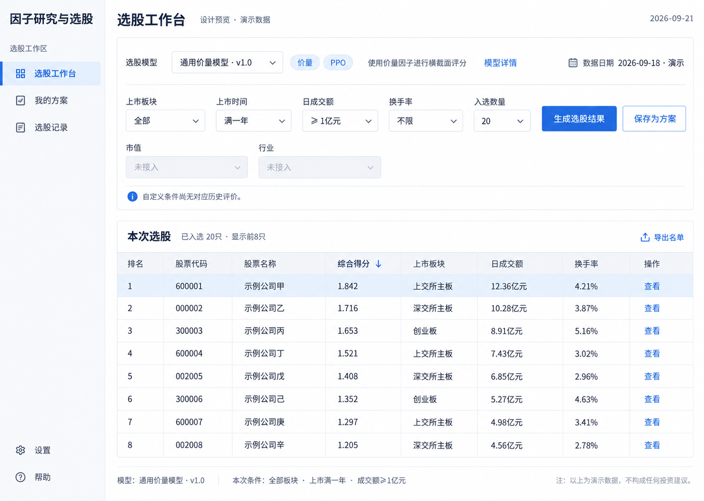

# 因子研究与选股系统：统一设计 v1

日期：2026-09-21。状态：根据用户逐项确认整合的功能与视觉基准；新系统尚未实现。实现计划、技术依赖选择和正式实验的具体数值配置在开发准备阶段落实。

## 1. 从哪里开始阅读

本文是后续实现的第一入口。使用以下文档时按职责和新旧决定解读：

1. 本文：当前系统范围、架构、页面与验收摘要。
2. [逐项确认记录](2026-09-21-integrated-design-decisions.md)：已确认的详细业务语义。后续确认优先于早期草案。
3. [研究闭环 v0.4](2026-09-20-research-closed-loop-v0.4.md)：数学定义、PPO/组合搜索、数据隔离、状态提交与对照方法；首版实际范围遵循本文。
4. [原始数据核对](2026-09-21-raw-data-inventory.md)：文件、441 字段和财务时点风险的事实依据。
5. [选定视觉稿](assets/2026-09-21-selection-workbench-approved.png)：2026-09-21 最后一组三张视觉方案中的第一张。只作为视觉和布局基准，示例数据不进入实际业务。

v0.1/v0.2/v0.3 为历史推导参考，不直接作为当前菜单、模型命名和过滤权限的实现依据。不要仅凭旧 v0.4 开始编写企业发布或新界面而忽略本次整合决定。

## 2. 建设目标和代码边界

建设具有真实研究反馈闭环的多因子系统，研究结果冻结为可执行的通用选股模型，前台在模型评分基础上应用用户条件，输出候选名单。

在 `closed_loop_research/` 新建独立系统，保留旧系统可运行。表达式解析、算子、PPO 算法库、数据读取、评分与保存逻辑按契约核验后复用；重新建设研究调度、组合增量奖励、数据隔离、模型版本与研究/选股界面。

交易回测器必须先验证交易时点、现金持仓、费用、成交失败和公司行动口径，再决定适配或重写。新系统能独立启动，不依赖用户先去旧界面生成文件再手动搬运。

## 3. 核心对象和交接关系

数据快照 → 研究实验 → 候选模型版本 → 人工设为可用 → 选股方案 → 选股结果。

| 对象 | 定义 |
|---|---|
| 数据快照 | 不可变的行情/属性版本与可用时点、字段字典、质量记录 |
| 研究实验 | 固定数据、字段、评分范围、交易协议、目标、预算与随机状态的研究运行 |
| 模型版本 | 冻结因子、权重、预处理、评分/标准化范围、数据要求和研究来源 |
| 模型展示信息 | 名称、说明、标签及使用状态；与不可变计算版本分离 |
| 选股方案 | 一个明确模型版本＋基础过滤条件＋Top N；可保存、加载和修订 |
| 选股结果 | 某次实际输入快照下的排名、名单、贡献、日期与运行证据，不能覆盖旧记录 |

研究自动迭代，候选自动保存，由维护者查看结果并决定哪些模型供前台使用。每轮 PPO 更新和池提交无需人工批准。候选/可用/停用是使用状态；评价是否完成和当前数据是否就绪是独立状态。

## 4. 研究闭环

固定实验协议 → PPO 生成公式候选 → 质量检查 → 基线与候选分别优化组合 → 固定 Top K 回测 → 配对增量奖励 → PPO 更新与批次池提交 → 下一批。

- 组合内层在 F 段搜索因子子集与权重，用交易评价改变后续提案或接受状态。
- 权重冻结后在 E 段比较候选与基线，增量扣除约定复杂度成本后进入 PPO 奖励。质量失败走明确失败奖励，基础设施故障不能伪装成因子失败。
- 批次内基线、数据与旧策略冻结，完成 PPO 更新后最多提交一个因子池版本；检查点保存完整协同状态。
- V 在预定检查点选择模型；T 只用于冻结后的最终测试，不能回流优化。

PPO 学习生成公式，不承担买卖动作；组合优化器首版实现一个可替换的基础搜索器，不强制遗传算法。用户临时前台过滤不进入训练奖励；首版不提供按每个用户过滤范围重新训练专用模型的流程。

首版固定 Top K、日频收盘评分与后续时点成交的研究协议。v0.4 提供目标、奖励、质量规则、预算和停止定义；正式启动前必须完整填写参数并锁定。具体日期分区须在实际可用历史和数据时点核验后确定，不能将演示日期直接写死。

首版对照覆盖简单固定因子、随机生成、单因子 IC 奖励与交易增量奖励，使用可比较口径和多随机种子；v0.4 中组合 IC 与更多消融属于随后扩展。小预算运行验收程序机制，不用于宣称研究有效。

## 5. 通用模型与前台过滤

选择模型 → 在模型规定的评分范围内计算完整分数 → 应用用户属性条件 → 对合格股票取 Top N。

过滤不改变模型权重、不重新标准化、不启动 PPO；不是先取 Top N 再过滤。研究/应用共用评分和字段语义。通用模型仍有声明的适用范围与数据要求，不能自动推广到不可计算的股票。

不同过滤条件用 AND；分类字段多选用集合包含。单位和日期口径明确，未知值不满足已启用条件。用户可以生成自定义配置，但其历史表现不能借用原模型回测。候选不足 N 时显示实际数量，不自动放宽条件。

成功计算自动保存结果；保存方案只保存配置，下次用新的可用数据重新评分。方案绑定具体模型版本，新版本不静默替换旧方案。模型停用或字段不可用时仍可查看历史，但不能无提示换模型后重新计算。

## 6. 数据范围

原始文件：`F:\my_code_file\因子构建\数据\daily_with_maindata_v2.csv`，约 19.8 GB，制表符分隔，441 个不重复字段。使用分批导入和标准快照，不在每次页面运行时重读整份文件。

只选部分字段用于因子生成与用户过滤，二者可重叠；标识、日期、文本和不可用字段不自动进入 PPO 空间。现有 47 列缓存不代表原始数据全集。

抽样已发现财务披露日期晚于对应交易日期。需要从源查询和历史版本核验/修复按时点数据；无法恢复的范围不能用于历史训练或属性过滤。可以先用核验后的价量字段验证闭环，不能把它声称为完整财务研究。

上市时间、板块、活跃度等条件按实际核验结果开放；行业、市值等字段未明确接入前不可假装可用。原始表中的 TotalShares 不能未经口径确认就当作每日流通股本。

## 7. 页面结构

一个系统通过工作区切换分为：

| 工作区 | 三个主要页面 |
|---|---|
| 研究工作区 | 研究项目、模型管理、数据中心 |
| 选股工作区 | 选股工作台、我的方案、选股记录 |

实验内部页签：实验配置、运行与迭代、因子与组合、回测与选股、验证报告。各页签共用实验上下文，系统自动衔接算法。实验对比在项目内组织；任务状态、设置、帮助为辅助入口。

选股工作台：模型摘要 → 过滤与数量 → 生成 → 名单 → 股票解释/保存方案/导出。模型介绍和验证摘要从模型选择处展开，不复制一套前台模型管理。历史结果沿用同一结果组件和解释规则。

## 8. 已选视觉基准

采用浅色主界面、蓝色强调、窄侧栏。顶部放模型及实际数据日期，中间是紧凑过滤表单和主操作，下方用完整宽度股票表格承载结果。点击股票再展开详情，默认不使用常驻侧边配置栏或解释面板挤占表格。

沿用截图的信息层次与间距方向，数值、标签和可用状态来自真实数据。演示股票/日期/得分不作为测试样本或真实研究成果，图片内附加文字不创造文档以外的业务功能。

其余页面延续同一视觉语言，按已确认职责细化。研究页以协议、轨迹和证据为中心，不照搬股票表单；空状态、运行中、失败、数据过期、字段不可用、无匹配股票都要有真实交互。

## 9. 首版边界与建设顺序

首版包含数据核验和快照、真实研究闭环、研究验证、模型管理、条件选股、方案与历史。延后数据库/API 自动同步、自动定时训练/发布、多模型融合、自然语言过滤、复杂条件嵌套以及前台自定义方案历史回测。

建设顺序：数据和可信交易评价 → 独立研究闭环 → 冻结模型与评分接口 → 六个主要页面 → 正式对照研究。先做可核验的小规模闭环，再扩大数据与搜索预算。

实施计划需为以下内容给出明确配置或实验：环境与依赖兼容、字段白名单和历史版本恢复、F/E/V/T 边界、费用与成交假设、λ/β/τ/δ 等目标参数、池容量与搜索预算、随机种子与停止规则、数据量下的性能测量。它们是实施前准备，不需要重新讨论已经确认的通用模型、工作区和菜单结构。

## 10. 验收与当前交付状态

- 质量失败与合法负奖励均保存；内层评价改变搜索状态，终止奖励进入真实 PPO 更新。
- 检查点恢复不重复更新或漏提交，下一批使用正确版本。
- T 数据及其缓存不进入开发路径。
- 冻结模型独立评分与研究相同输入结果一致。
- 可用模型能在前台按条件生成名单，评分/过滤顺序正确。
- 方案与结果追溯到具体模型、数据、条件、N；改版不覆盖历史。
- 页面指标来自实际产物，失败和未运行不显示编造结果。

当前完成设计文档和视觉选定，未新建实现目录、未开发新程序、未生成交互原型。下一阶段根据本文制定分阶段实施计划，再按建设顺序实现；不直接把旧系统换皮当作新闭环系统。
